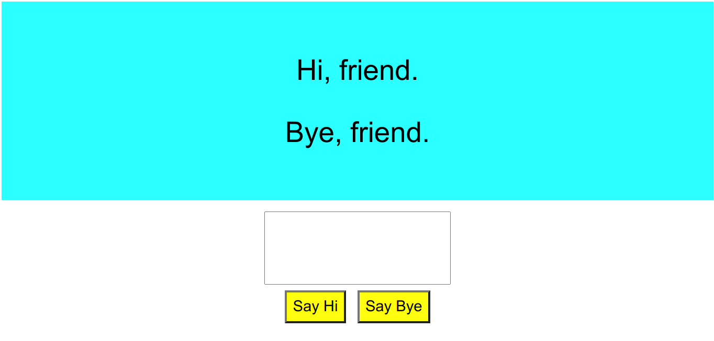

# Hi, Friend. Bye, Friend.

## Setup

1. Make a fork of this repo
2. Clone your fork to your local development environment
3. Change to the project directory
4. Install dependencies: `yarn install`
5. Run the application: `yarn start`
6. Verify the application runs as expected

### What you should see

You'll notice that the buttons and text field don't seem to "do" anything. You can type into the text field and press the buttons, but they don't change what you see on the screen.

## Challenge
This challenge will help you practice your understanding of conditional rendering of components in React.

This is a very simple and polite application. If you say Hi, it says Hi back. When you say Bye, it says tells you Bye. And if you tell it your name, it will greet you personally! 

It should behave like this: 
<iframe width="560" height="315" src="https://www.youtube.com/embed/nSCMZ2v4OZ4" frameborder="0" allow="accelerometer; autoplay; clipboard-write; encrypted-media; gyroscope; picture-in-picture" allowfullscreen></iframe>

The steps to complete this challenge are below. This challenge is also full of bonus learning opportunities mentioned in the code comments.

**Before you begin: Investigate console log**

Look at the application console log output in the terminal where you ran `yarn start`.

Notice that there are warnings in App.js, Hello.js, and Goodbye.js for unused variables. 

If you open the console in the browser where the app is running, you should see the same warnings. 

It is important when you are investigating an implementation, to figure out how it works or solve issues, that you look both in the terminal console and in the browser console to help you understand what is happening.

The warnings you see point to what needs to be changed in the code scaffold to complete the challenge. 

**Part 1: Implement conditional rendering of name in Hello**

In Hello.js, you will refactor the code in the return statement to either render "Hi, friend", or to render "Hi, `name`", where `name` will be passed in with props when something is typed into the text field on the screen. 

The code that passes the information from the text field to the Hello component is already written for you. You can examine it to try to understand how it works. 

But all you have to do is to alter the return statement in Hello.js to check for name, and to render the name if it is not null.

**Part 2: Implement conditional rendering of name in Goodbye**

You will do the same thing in Goodbye.js that you did in Hello.js. Practice makes perfect!

**Part 3: Conditionally render the Hello or Goodbye component.**

In App.js, currently both the Hello and Goodbye components are being rendered. 

Your challenge is to render only the Hello component when `isArriving` is set to `true`. App should only render the Goodbye component when `isArriving` is `false`.

You should refactor code in the return statement in App.js to accomplish this.

## Tests and Submitting

At any time you can run `yarn test` to see your progress. By default it will run in `watch` mode, and you will have to press `q` to quit. It will run the automated tests against your code and let you know what your progress is so far. Once you have all the tests passing, you can submit your challenge. To do this make sure you have committed your work:

1. From the project root `git add .` and add all the files changed in this folder
2. Commit these files to your repository `git commit -m "challenge completed"`
3. Make sure your working tree is clear `git status`
4. Push these files to your github repository `git push origin master`
5. Log on to Github and visit your fork of this challenge.
6. Make a pull request to the main branch.
7. Wait and watch the final tests run, if you are successful it will automatically let your educators know you are finished.